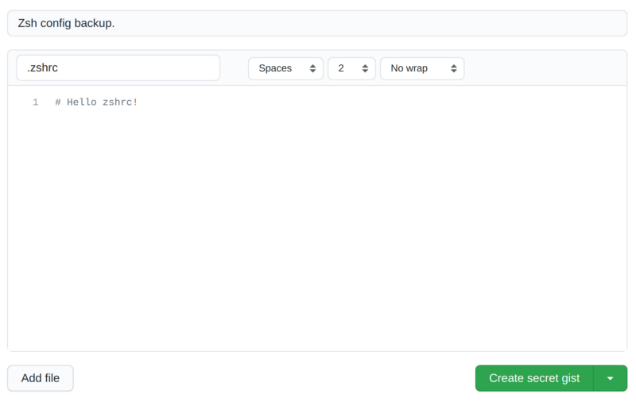

Art by my buddy [Loor Nicolas](https://www.instagram.com/loornicolas/)

---

#### THE PROBLEM

You get a new computer, you back up all your files but…

OH! you forgot to back up your `~/.bashrc` or `~/.zshrc` where all your custom aliases and functions live! Now you need to start over with them…

#### A SOLUTION

To save you this headache, I’m sharing my super-useful custom alias for updating my shell config that does the following:

1. Opens your shell config file.
2. Saves a copy of the updated file on a secret [Github Gist](https://gist.github.com/).
3. Refreshes your shell session so you can use the updated command right away.

Let’s set it up.


> This tutorial assumes you’re using [zsh](https://www.zsh.org/). If your are using [bash](https://www.gnu.org/software/bash/), just replace `zsh` and `.zshrc` by `bash` and `.bashrc` in the next commands. You can find out which shell you’re using by running `echo $0`.

1. Let’s create a secret [gist](https://gist.github.com/) where our config will be saved:



Creating a secret [Gist](https://gist.github.com/).

2. Copy the Gist identifier from the URL, the last part. In my case the URL is `https://gist.github.com/jportella93/616c872593daf91781d6842c9829b1f0` so I’m copying `616c872593daf91781d6842c9829b1f0` .

3. In your `~/.zshrc` include this line:

```shell
alias zshrc="gedit ~/.zshrc && \
gist-paste -u 616c872593daf91781d6842c9829b1f0 ~/.zshrc && \
exec zsh"
```

> I’m using [gedit](https://help.gnome.org/users/gedit/stable/) as text editor but you can use any other like `nano`, `vim` or `code` . Then replace the gist identifier `616c872593daf91781d6842c9829b1f0` with the one you copied in the previous step.

4. If you haven’t already, install [gist](https://github.com/defunkt/gist) to be able to interact with Github Gist from the CLI.

5. Now you’re all set! When you want to update an alias in your `~/.zshrc` just type `zshrc` in your CLI, make changes on your text editor, and changes will be backed up on the Gist automatically. Moreover, you’ll be able to use your updated alias right away! How cool is that?
