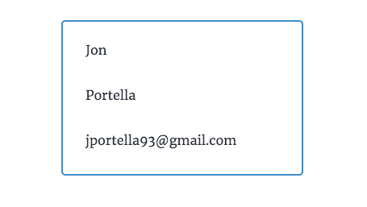
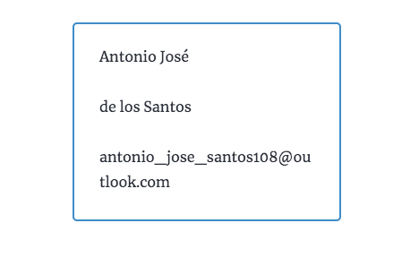

So imagine you have a component that shows some user information like name, surname and e-mail. The design shows a nice layout where all lines take the same space.



Easy enough, you implement the design and release it into the wild. But then you realize that this UI can break with a person with a longer name.



That's because the data being shown has **variable length** and you should account for all the cases where it will be used. <a href="/displaying-data-with-variable-length-example#example-1" target="_blank">Here is a demo with the example.</a>

There will be users with super long names, e-mail addresses and what not and this shouldn't break your UI. One approach to prevent this would be to create a wrapper component for variable length text which is expected to be shown in a single line. All overflowing text can be scrolled to the side if needed.

```jsx
const oneLineScrollerStyle = {
  overflow: 'hidden' // Avoid breaking UI
}

const oneLineScrollerChildrenWrapperStyle = {
  whiteSpace: 'nowrap', // Render text in one line
  display: 'block',
  overflow: 'auto', // Scroll overflow if needed
}

const OneLineScroller = ({ children }) => (
  <span style={oneLineScrollerStyle}>
    <span style={oneLineScrollerChildrenWrapperStyle}>
      {children}
    </span>
  </span>
);
```

Wrapping your text fields with this component makes them span exactly one line. [Example #2 has the OneLineScroller](/displaying-data-with-variable-length-example#example-2).
