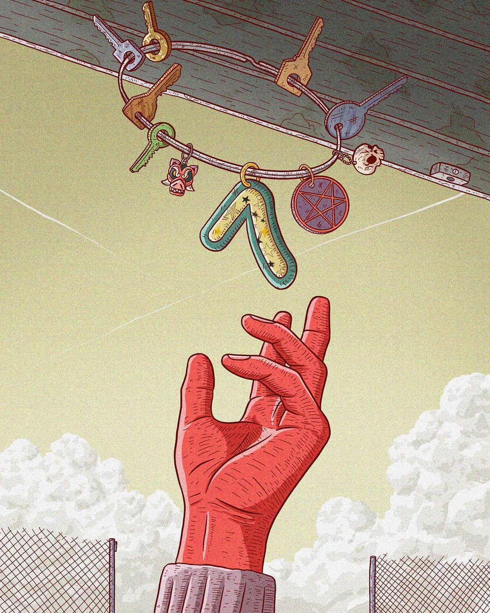

## The Beginning — My Old Job

Barcelona, 2018.

I was working as a live audiovisual technician in events like shows and conferences. It was my first serious job that I landed after graduating of my Audiovisual Communications degree.

I didn’t quite like it because the working hours were terrible so I couldn’t really have a social life out of work. Moreover, the senior employees in the company didn’t seem very happy with their situation either.

So **there wasn’t a nice future for me** by doing that.

After a very intense project, I decided to quit the job. I didn’t have a plan B, I just knew I had to stop it cold turkey before finding something else— Impulses are my thing.

## The Search — A Better Future

I was in my mid-twenties and the most logical step after my degree in Audiovisual Communications was to do some master’s degree.

After some research, it seemed like **every master's degree cost around 10k**. I thought it was a fair price if that was going to land me with a better-paying job, but **the ratios of graduated to employed were pretty low**. Besides, the skills they taught didn’t seem that useful and I wasn’t really interested in them.

## First Idea — Masters Degree in Digital Marketing

In the end, as it seemed I had to pick something and I always was an Internet-friendly person, I picked a Masters's Degree in Digital Marketing.

However, before actually enrolling, I asked a friend who was working as a digital marketer at the time. In hindsight, that is the best thing I did in a long time.

She told me **that was a really bad idea** since she knew me and my profile was none as it was expected for the job. I’d have hated every moment of it.

## Second Idea — Software Engineering Bootcamp

However, she gave me the idea to enroll in a Software Engineering boot camp. I didn’t really understand that, since **I hadn’t any engineering or coding experience.**

She said that a person from her company did it and now was working as a developer and that I would probably be able to do it too. That was 3 intense months of study but, after that, **it was easy to land a good-paying job**.

## Choosing a Bootcamp

I decided on the boot camp and started comparing. I was looking for something in the Barcelona area. There were many options but in the end, I boiled it down to two: [Ironhack](https://www.ironhack.com/) or [Codeworks](https://codeworks.me/).

Both of them would **take me around 3 months to complete**, but Ironhack was substantially more economic. On the other hand, Codeworks seem to be much more in-depth. Also, despite being a 10k investment, **their graduate-to-employee ratio was unbeatable**. So I decided to pick Codeworks and booked an appointment for an intro interview.

## The Selection Process — Part 1. The test

The process consisted of a one-hour coding test in the boot camp premises and a coding assignment to take home and complete in a week. After setting a date for the test, they pointed me to some free online resources about HTML, CSS, and JavaScript to prepare for the test.

I learned an immensely high amount of concepts in a short time only by going through those online resources to prepare for the test. **I hadn’t learned that much since university.**

On the day of the test, while I was getting to the office, I was very nervous. The test consisted of resolving a set of simple JavaScript algorithms in a computer next to an instructor. Despite being shaky, I did it correctly and passed the test.

## The Selection Process — Part 2. The assignment

Now it was time for the take-home assignment. The instructor let me chose between 3 projects and I — completely dedicated to this new path — took the most difficult one: building a BlackJack game.

I was working on the assignment for the whole week. I became an expert in searching Google and Stack Overflow for problems that appeared in my code and, in the end, **I achieved [a very decent BlackJack game](https://jportella93.github.io/Blackjack/index.html) that impressed the reviewers**.

## The Pre-Course

After this, I paid a part of the tuition and received my pre-course resources, which consisted of 3 very complex exercises which I had to finish in order to get admitted to the boot camp.

These were **really difficult**. It touched very complex JavaScript concepts which many professional developers don’t really know. However, after 2 intense weeks, I finished them and was ready to start the course!

## The Course

I started in the April batch. In my batch, there were 13 more people from around the world who also were aspiring Software Developers.

**Those were 3 intense months**. We were on campus from Monday to Saturday, from 8.30 am to 9 pm. And sometimes we’d also go on Sunday to recover topics.

It was hands-down **the most intense learning experience I had**. We went in-depth over every topic related to working as a Software Developer. When we were about to master a concept, we were already starting with the next one. There was virtually no time to get bored, it was frenetic. The instructors **were very good** and helped us when we got stuck.

After the first half of the course learning and solidifying all the topics. There was the second half, where we build 3 web applications from the ground up. **These proved invaluable for the job search**. Finally, in the last part of the course, we spend some time focusing in how to get a good developer job and how to ace interviews.

## My Post-Bootcamp Job

As soon as I finished the boot camp, my job became finding a job. I spent several hours a day going through LinkedIn and other job boards, contacting recruiters, and doing tests. I made a spreadsheet with all the companies I had applied to, the contact person, and the state of the selection process.

**Three weeks after graduating**, after several interviews, I found a company that seemed really interesting, [Curelator N1-Headache](https://n1-headache.com/). Their mission is to help people suffering from migraine to control them by using an individualized analytical approach. I had a couple of meetings with the company and decided it was a good place to start my career as Software Developer, **I got hired**.

The best part was that **I recovered my boot camp investment in 3 months.**

## Two Years Later

I’m still in the same company, currently as a Front-End Engineer. **I have an important role over most products in the company**. Besides, I’ve learned a number of skills and keep doing so every day.

Also, one day a week, I’m **forming new Software developers** in the boot camp where I learned everything on this subject. Recently, [the boot camp raised to the top five best Software Engineering boot camps in the whole world](https://www.switchup.org/rankings/best-coding-bootcamps).

I usually work remotely. And **both of my jobs haven’t been affected a bit by the COVID19 situation**.

## Bottom Line

When I see social media posts of my ex-coworkers complaining about how since the COVID19 crisis there are no jobs, I confirm that **following my gut and leaving that company was the best decision ever.**

So don’t be afraid to reinvent yourself. **If you fancy a change… go for it!**
