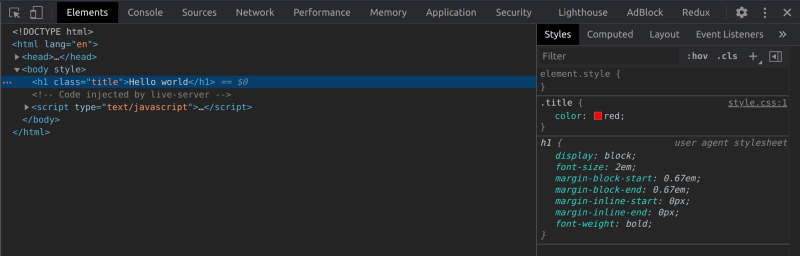

---

#### THE PROBLEM

Using your dev tools to tinker with CSS is great because you get immediate feedback on the changes. However, if the page is refreshed, all those changes get lost in oblivion…

#### A SOLUTION

Here’s a quick tip to persist those changes without affecting your original source files.

1. Open Chrome’s dev tools.

2. Press ctrl/cmd + shift + p to show [Chrome’s dev tools command menu](https://developers.google.com/web/tools/chrome-devtools/command-menu).

3. Type “show overrides”.

4. Tap on “+ Select folder for overrides” on the left side and select a folder on your machine. That’s where your overrides will live.

5. Allow Chrome to access this folder by tapping “Allow” on the bar that appears below the search bar.

6. Now the folder has appeared on the “Overrides” section.

7. Let’s try it! Change some styles in the “Elements” panel. You’ll see a purplish dot next to the stylesheet file name, which means it has been saved locally in our overrides folder. Refreshing the page will keep that change!

8. Now back in the “Overrides” tab, we can see those local overrides, sorted by URL folders.

9. (BONUS!) To see the diff between your source code and the local overrides, you can type “Show changes” on the command menu.

---
