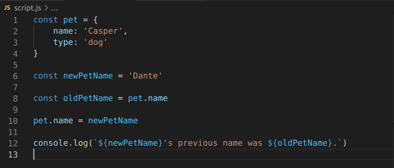
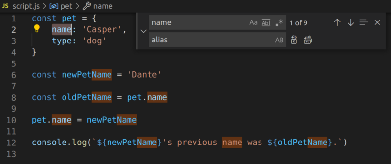
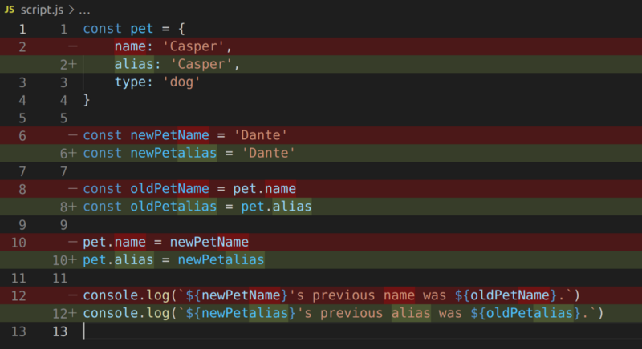
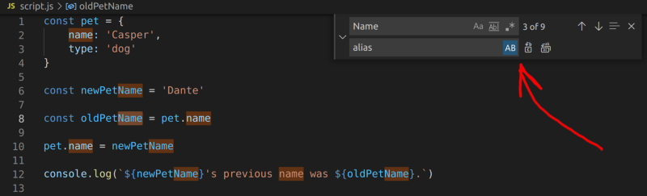
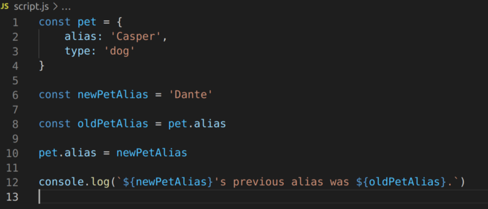

---

#### THE PROBLEM

We have a `pet` object, whose value under the key of `name` we are changing. We are saving a reference to the old value that the key `name` pointed to for logging purposes.

Now we realize that we’d like to rename the key `name` to `alias`. A refactoring is in order. So we pull up the find and replace feature by pressing ctrl/cmd + f.

But oops! as they key `name` is also used in camelCase as part of other variables names `newPetName` and `oldPetName` , we get a casing mismatch after replacing. `newPetalias` and `oldPetalias` don’t look so good…

#### A SOLUTION

We are going to undo this change and repeat it using the [preserve case option on the find and replace feature](https://code.visualstudio.com/docs/editor/codebasics#_advanced-find-and-replace-options) by pressing the `AB` button.

Now we’ve saved time refactoring and our pets are happy with their aliases!

---
