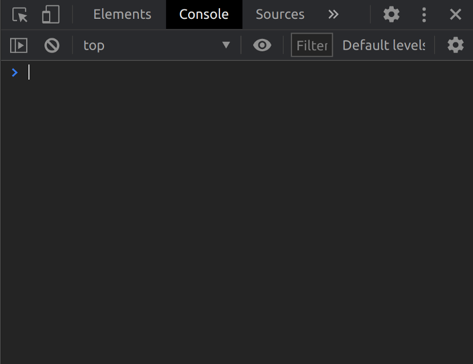
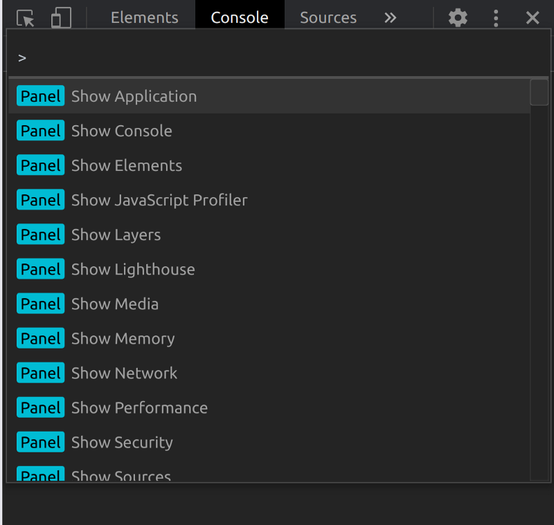
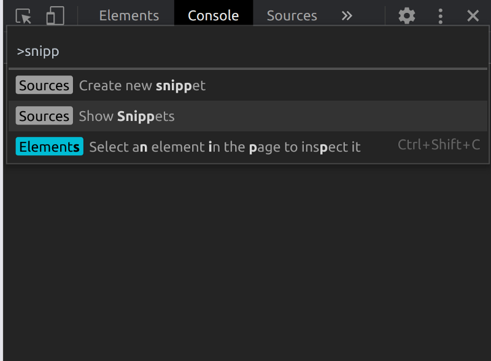
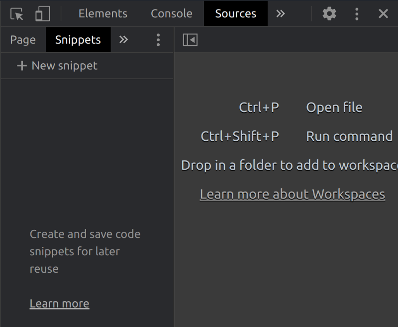
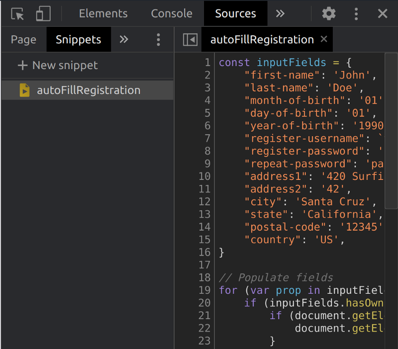

Illustration by my buddy [Loor Nicolas](https://www.instagram.com/loornicolas/)

#### THE PROBLEM

You want to test a registration form on a website. Instead of filling it up manually every time, you may come up with a snippet like this that does it automatically for you:

```js
const inputFields = {
    "first-name": 'John',
    "last-name": 'Doe',
    "month-of-birth": '01',
    "day-of-birth": '01',
    "year-of-birth": '1990',
    "register-username": `test+autocomplete+${Math.floor((Math.random() * 10000000))}@example.com`,
    "register-password": 'password1',
    "repeat-password": 'password1',
    "address1": '420 Surfing St.',
    "address2": '42',
    "city": 'Santa Cruz',
    "state": 'California',
    "postal-code": '12345',
    "country": 'US',
}

// Populate fields
for (var prop in inputFields) {
    if (inputFields.hasOwnProperty(prop)) {
        if (document.getElementById(prop)) {
            document.getElementById(prop).value = inputFields[prop]
        }
    }
}

// Check checkboxes
document.querySelectorAll('input[type="checkbox"]').forEach(input => !input.checked ? input.click() : null)

// Submit form
document.getElementById('buy-now-button').click()
```

Now, instead of copy-pasting it over and over, it would be great if we could store it on the browser so when we want to use it we can retrieve it and run it easily.

#### A SOLUTION

Fortunately, Chrome’s DevTools provide functionality for this: [snippets](https://developers.google.com/web/tools/chrome-devtools/javascript/snippets).

1. Open [Chrome’s DevTools](https://developers.google.com/web/tools/chrome-devtools/open).



2. Press ctrl/cmd + shift + p to show [Chrome’s ](https://developers.google.com/web/tools/chrome-devtools/command-menu)[DevTools](https://developers.google.com/web/tools/chrome-devtools/open)[ command menu](https://developers.google.com/web/tools/chrome-devtools/command-menu):



3. Type “show snippets” and select that option



4. This will reveal the Snippets tab under the sources panel.

Tap on `+ New snippet`



5. Name your snippet and input its content on the right-hand panel.



Now that your snippet is saved, you can press **ctrl/cmd + enter to run iton the page**!

Snippets will persist between browser sessions, so you can retrieve and run them easily.

**BONUS**: here’s [a list of snippets](https://bgrins.github.io/devtools-snippets/) to get you inspired.

