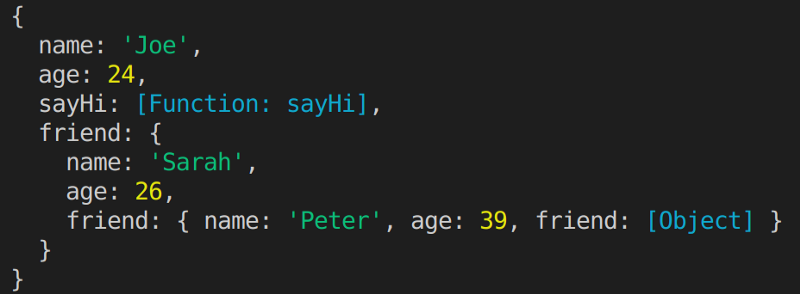
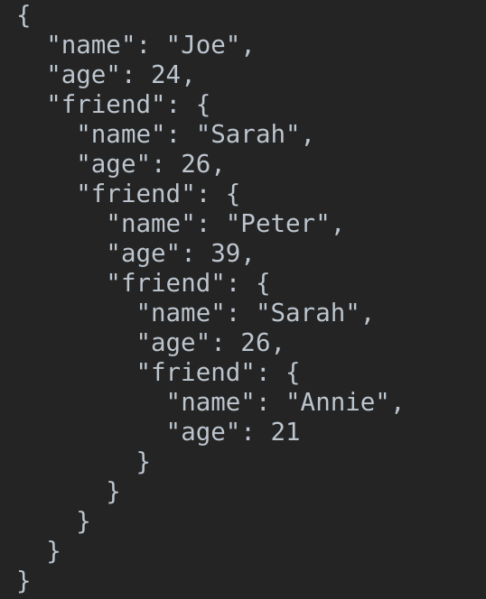
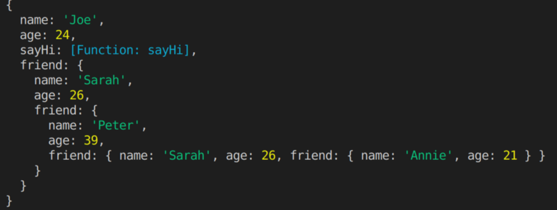

---

#### The problem

We want to log in to the console this deeply nested JavaScript Object:

```js
const person = {
  name: "Joe",
  age: 24,
  sayHi: function () {
    console.log("Hi!");
  },
  friend: {
    name: "Sarah",
    age: 26,
    friend: {
      name: "Peter",
      age: 39,
      friend: {
        name: "Sarah",
        age: 26,
        friend: {
          name: "Annie",
          age: 21,
        },
      },
    },
  },
};
```

#### A Naive Solution

The common beginner mistake is to just put it through the most basic logging tool that the language provides: `console.log`. However, we have limited depth logging, making`friend` on the third level just appear as `[Object]`:



Console.log: Hidden third level as `friend: [Object].`

#### A Hacky Solution

A trick I’ve used in the past is to put it through JSON.stringify with two extra arguments:

```js
console.log(JSON.stringify(person, null, 2));
```

You can read about what these do in [MDN](https://developer.mozilla.org/en-US/docs/Web/JavaScript/Reference/Global_Objects/JSON/stringify).

But this approach carries some problems:

1. Functions will disappear from the output.
2. You won’t get syntax highlighting, as you’re basically logging a formatted string.



JSON.stringify: no colors and… where’s is `sayHi()`??

#### **A (BETTER) SOLUTION**

Use

```js
console.dir(person, { depth: null });
```

That will show all nested objects, including functions, with syntax highlighting.


