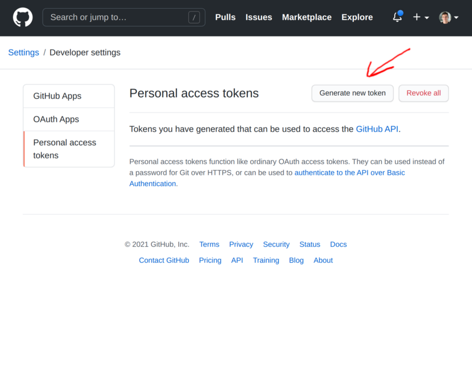
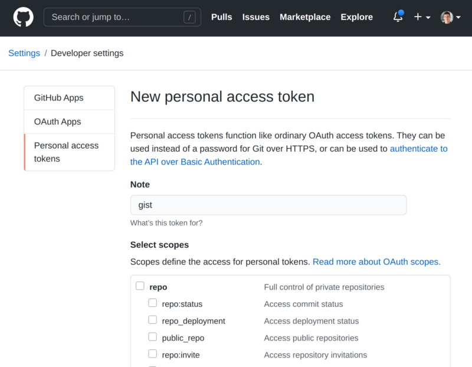
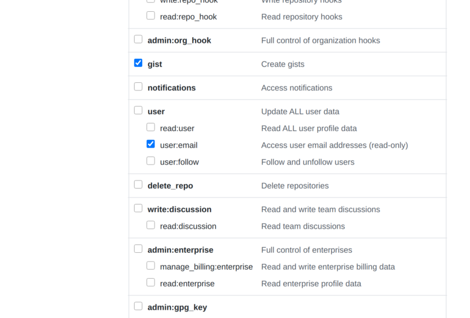
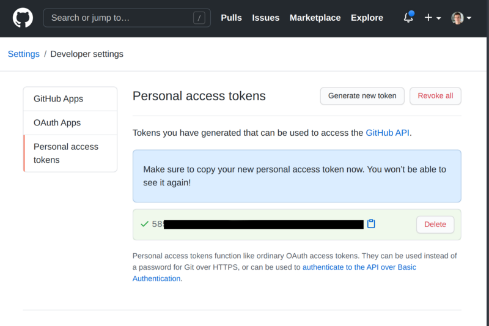

---

#### THE PROBLEM

You are saving [Github Gists](https://gist.github.com/) often but you spend too much time on their UI.

#### A SOLUTION

Let’s do it from our CLI!

1. Install [Gist](https://github.com/defunkt/gist) following the [instructions for your system](https://github.com/defunkt/gist#installation). In my case is Ubuntu so:

```shell
sudo apt install gist
```

2. Go to the [tokens section in GitHub](https://github.com/settings/tokens) and press on “Generate new token”. Input your password in the next screen:



3. Set a name for your token and make sure to check the `gist` and `user:email` permissions:



Set a name for your token like `gist.`



Check **gist** and **user:email** permissions.

4. Copy your generated token:



5. Save the token in `~/.gist`. The `umask` ensures that the file is only accessible from your user account:

```shell
(umask 0077 && echo MY_SECRET_TOKEN > ~/.gist)
```

6. Check that it has been saved correctly:

```shell
cat ~/.gist
```

7. Now we can create gists from the command line!

> Note that in Ubuntu/Debian the `gist` command is renamed to `gist-paste` to avoid conflicts, if you are using a different system like MacOS just replace `gist-paste` for `gist` in the next snippet.

```shell
echo "hello gist" >> gist.txt
gist-paste gist.txt
# Returns URL of newly created gist https://gist.github.com/eb36806673aca3c63686078d584e2a2e
```
